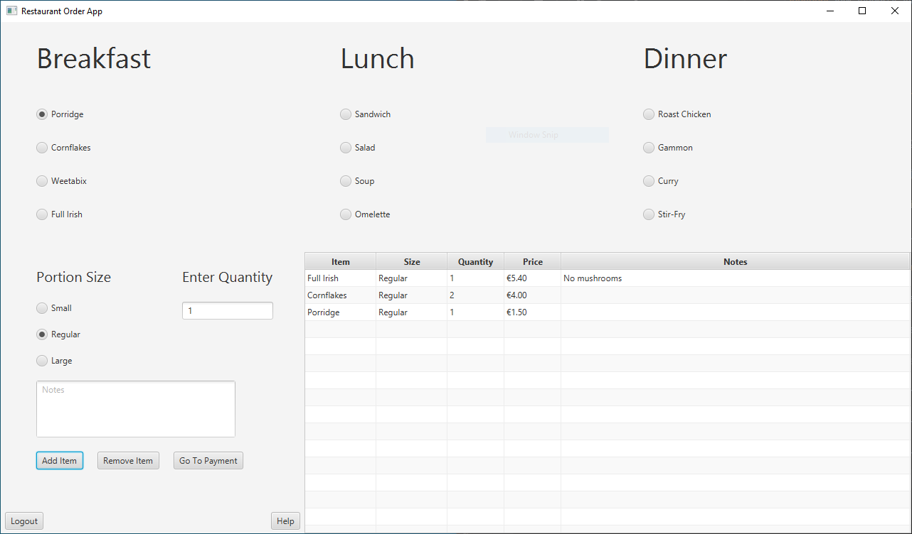
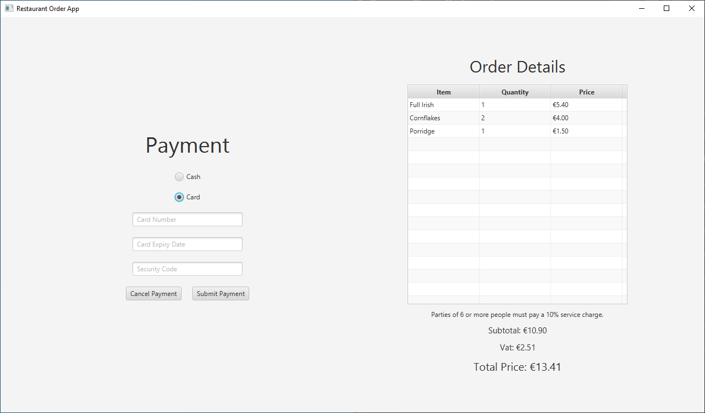
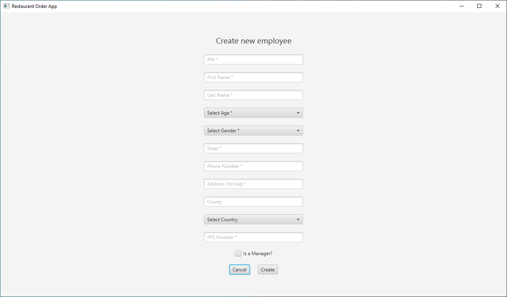

# JavaFX-Restaurant-Ordering-Application

## Description

An JavaFX app where the user can take a customer's order from a menu and take payment for the items chosen.

## Running This App

This project was made in IntelliJ IDEA so the easiest way to run this project is to create a new project from version control in IntelliJ IDEA.

For information about running JavaFX in other IDEs, please refer to the openjfx documentation that can be found at [https://openjfx.io/openjfx-docs/](https://openjfx.io/openjfx-docs/)

## Images

The Menu Screen

The Payment Screen

The Screen to Create a New Staff Member Who Can Then Use the App

